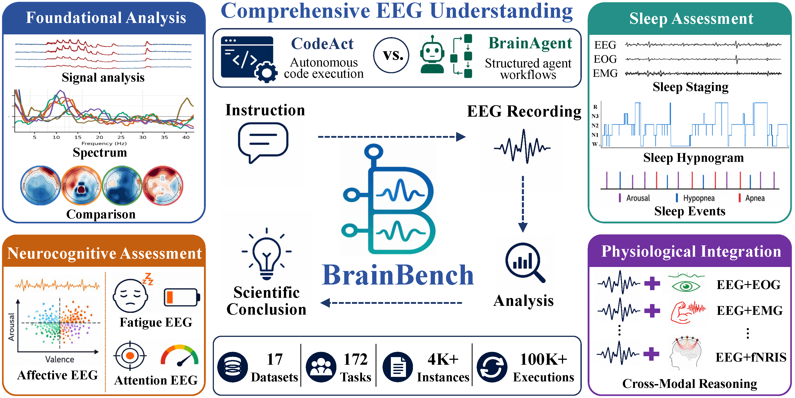

<h2 align="center">
  
   
  Benchmarking LLMs for Comprehensive EEG Understanding
</h2>
 

  

  BrainBench is a benchmark and evaluation framework for comprehensive EEG understanding, evaluating how large language models and agentic systems analyze real-world EEG recordings and produce scientifically grounded conclusions.

  <a href="#">&#128196; ArXiv Paper</a>
  &nbsp;|&nbsp;
  <a href="#">&#127760; Website</a>
  &nbsp;|&nbsp;
  <a href="#">&#129303; Hugging Face</a>
  &nbsp;|&nbsp;
  <a href="#">&#128640; Quickstart</a>
  &nbsp;|&nbsp;
  <a href="#">&#128218; Citation</a>

